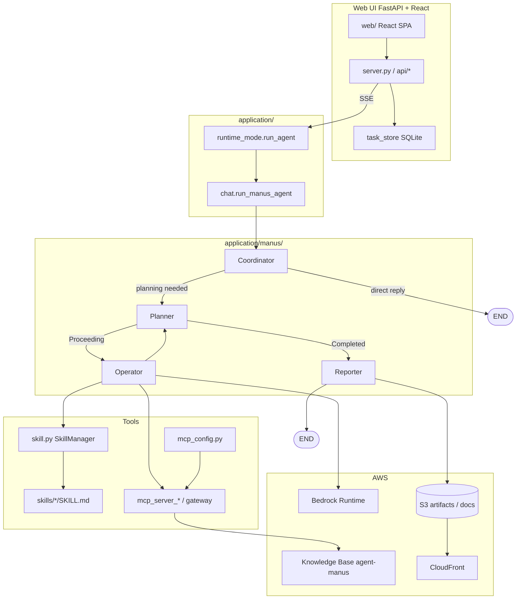

# Agent Manus

Manus multi-agent(Coordinator → Planner ↔ Operator → Reporter)를 **agent-skills**와 같은 FastAPI + React / Skills + MCP 구조로 실행합니다. UI·설정·RAG·Memory는 agent-skills와 공유하고, Agent 실행만 LangGraph ReAct 대신 Manus 파이프라인으로 바꿉니다.

기반: [Bedrock-Manus](https://github.com/aws-samples/aws-ai-ml-workshop-kr/tree/master/genai/aws-gen-ai-kr/20_applications/08_bedrock_manus), [LangManus](https://github.com/Darwin-lfl/langmanus)

Bedrock Manus·LangManus처럼 Planning 기반 fully automated multi-agent로 복잡한 요청에도 보고서를 만들고, [MCP](https://github.com/modelcontextprotocol)로 다양한 데이터 소스를 연결합니다. [LangChain MCP adapter](https://github.com/langchain-ai/langchain-mcp-adapters)로 여러 MCP 서버의 tool을 가져와 Operator가 실행하고, [LangGraph Builder](https://build.langchain.com/)로 워크플로를 설계합니다.

전체 architecture 개요:


## 개요

Web UI는 **FastAPI + React**이며, Agent는 **같은 프로세스**의 Manus LangGraph로 실행합니다.

| 구분 | 경로 | 역할 |
|------|------|------|
| Web UI | `application/server.py`, `application/web/` | Task·Chat·Skill/MCP 설정, SSE 스트리밍 |
| Agent | `application/runtime_mode.py` → `chat.run_manus_agent` → `manus.run_manus` | Coordinator / Planner / Operator / Reporter |
| Skills / MCP | `application/skills/`, `mcp.list`, `mcp_config.py` | UI에서 선택 후 Operator tools에 주입 |
| 설정 | `application/config.json`, `skills.list`, `favorite_tools.json` | AWS·모델·기본 Skill/MCP |
| 인프라 | `installer.py` | 공유 S3/CloudFront + 프로젝트 KB (`docs/agent-manus/`) |

```text
Browser (React :8501)
    │  REST + SSE (/api/tasks/{id}/chat)
    ▼
FastAPI (application/server.py)
    │  runtime_mode.run_agent → chat.run_manus_agent
    ▼
Manus (Coordinator → Planner ↔ Operator → Reporter)
    + MCP (kb-retriever, tavily, …) + Skills
    + S3 artifacts via CloudFront sharing_url
```

Streamlit / CDK / lambda-rag는 사용하지 않습니다. Knowledge Base 조회는 **kb-retriever MCP**(Bedrock Retrieve)입니다.

## Operation Architecture



| 기능 | 모듈 | 설명 |
|------|------|------|
| Chat (SSE) | `api/routes_chat.py` → `runtime_mode.run_agent` | Task별 스트리밍 대화 |
| Agent | `manus/` StateGraph | Planning 기반 multi-agent |
| Skills | `skill.py` + `skills/` | Operator에 skill tools 주입 |
| MCP | `mcp_config.py` / `mcp_server_*.py` | 선택 서버 → Operator tools |
| RAG 업로드 | `api/routes_rag.py` | 사용자별 S3 업로드 + KB sync |
| Memory | Sidebar Memory 토글 + MCP `memory` | AgentCore Memory |
| Graph | `api/routes_graph.py`, `graph/` | 사용자별 Knowledge Graph HTML |

## 상세 구현

### LangGraph Builder로 Workflow 정의

[LangBuilder](https://build.langchain.com/)에서 아래와 같이 워크플로를 그린 뒤, 우측 code generator로 LangGraph 코드를 생성합니다. 생성된 `stub.py`, `spec.yml`, `implementation.py`를 내려받아 노드를 구현합니다. 자세한 내용은 [Developing Agents with LangGraph Builder](https://github.com/kyopark2014/langgraph-builder)를 참고하세요.


LangGraph Studio에서 그래프로 그리면 다음과 같습니다.


현재 저장소의 그래프 정의는 [application/manus/stub.py](./application/manus/stub.py), 노드 구현은 [application/manus/implementation.py](./application/manus/implementation.py)입니다.

### State

Manus는 Planning으로 fully automated agent를 구현합니다. `full_plan`에 LLM이 수행할 계획을 두고, `messages`에 연속 실행 결과를 쌓습니다. `final_response`·`report`로 최종 답과 리포트를 채팅에 표시하며, `appendix`에 이미지 등 부록을 모읍니다.

```python
class State(TypedDict):
    full_plan: str
    messages: Annotated[list, add_messages]
    appendix: list[str]
    final_response: str
    report: str
```

### Multi-agent 구조

```text
START → Coordinator
            ├─(직접 응답)→ END
            └─(to_planner)→ Planner ⇄ Operator
                                  └─(Completed)→ Reporter → END
```

| 노드 | 프롬프트 | 역할 |
|------|----------|------|
| **Coordinator** | [coordinator.md](./application/manus/coordinator.md) | 단순 질의는 바로 답하고, planning이 필요하면 Planner로 라우팅 |
| **Planner** | [planner.md](./application/manus/planner.md) | `full_plan` / messages로 계획 수립·갱신. `<status>Completed</status>`면 Reporter로 |
| **Operator** | [operator.md](./application/manus/operator.md) | 계획의 한 단계를 MCP/Skill tool로 실행 후 Planner로 복귀 |
| **Reporter** | [reporter.md](./application/manus/reporter.md) | 최종 리포트 markdown 작성, S3 artifact 발행 |

Coordinator는 planning이 필요할 때만 Planner로 보냅니다. Planner가 계획을 만들고, Operator가 계획에 지정된 tool을 실행합니다. tool 실행 시 독립 agent가 만들어지므로 전체는 multi-agent로 동작합니다.

```python
# application/manus/stub.py
builder.add_node("Coordinator", nodes_by_name["Coordinator"])
builder.add_node("Planner", nodes_by_name["Planner"])
builder.add_node("Operator", nodes_by_name["Operator"])
builder.add_node("Reporter", nodes_by_name["Reporter"])

builder.add_edge(START, "Coordinator")
builder.add_conditional_edges(
    "Coordinator",
    nodes_by_name["to_planner"],
    [END, "Planner"],
)
builder.add_conditional_edges(
    "Planner",
    nodes_by_name["to_operator"],
    ["Operator", "Reporter"],
)
builder.add_edge("Operator", "Planner")
builder.add_edge("Reporter", END)
```

요청 흐름:

1. Web UI `POST /api/tasks/{id}/chat` (SSE)
2. `runtime_mode.run_agent` → `chat.run_manus_agent`
3. `manus.run_manus` — 선택 MCP/Skill로 tools 로드 후 StateGraph 실행
4. 중간 상태·토큰은 notification queue → SSE (`token` / `tool` / `done`)
5. Reporter 결과 + HTML/DOCX 링크를 **최종 결과** 섹션과 CloudFront URL로 반환

### Coordinator

[coordinator.md](./application/manus/coordinator.md)로 system prompt를 만들고 사용자 입력을 처리합니다. 프롬프트가 `to_planner`를 요구하면 Planner로 보내고, 아니면 `final_response`에 답을 넣어 END로 종료합니다.

```python
async def Coordinator(state: State, config: RunnableConfig) -> dict:
    question = state["messages"][0].content
    system_prompt = get_prompt_template("coordinator")

    llm = chat.get_chat()
    chain = ChatPromptTemplate.from_messages(
        [("system", system_prompt), ("human", "{question}")]
    ) | llm
    result = chain.invoke({"question": question})

    final_response = ""
    content = result.content if isinstance(result.content, str) else _coerce_text(result.content)
    if content.find("to_planner") == -1:
        final_response = content.split("<next>")[0].strip()

    return {"final_response": final_response}


async def to_planner(state: State) -> str:
    if state.get("final_response"):
        return END
    return "Planner"
```

### Planner

[planner.md](./application/manus/planner.md)로 system prompt를 구성하고, state 전체와 사용 가능 MCP/Skill tool 목록을 입력으로 넘깁니다. 계획이 끝나면 `<status>Completed</status>`를 넣고, 진행 중이면 `Proceeding`으로 Operator에 넘깁니다. 생성된 plan은 `artifacts/{request_id}_plan.md`에 저장됩니다.

```python
async def Planner(state: State, config: RunnableConfig) -> dict:
    tools = _cfg(config, "tools")
    mcp_tools = get_mcp_tools(tools)
    system = get_prompt_template("planner")

    llm = chat.get_chat()
    chain = ChatPromptTemplate.from_messages(
        [("system", system), ("human", "{input}")]
    ) | llm
    result = chain.invoke({"mcp_tools": mcp_tools, "input": state})

    # S3에 plan 기록
    request_id = _cfg(config, "request_id", "")
    chat.updata_object(
        f"artifacts/{request_id}_plan.md",
        f"## {datetime.now():%Y-%m-%d %H:%M:%S}\n" + result.content,
        "prepend",
    )

    output = result.content
    if output.find("<status>") != -1:
        status = output.split("<status>")[1].split("</status>")[0]
        if status == "Completed":
            return {
                "full_plan": result.content,
                "final_response": state["messages"][-1].content,
            }

    return {"full_plan": result.content}


async def to_operator(state: State, config: RunnableConfig) -> str:
    if state.get("final_response"):
        return "Reporter"
    return "Operator"
```

### Operator

생성된 plan에 따라 적절한 tool을 실행합니다. [operator.md](./application/manus/operator.md)로 다음에 쓸 tool 이름(`next`)과 작업(`task`)을 JSON으로 받고, [MultiServerMCPClient](https://github.com/langchain-ai/langchain-mcp-adapters) / Skills에서 로드한 tool 중 매칭되는 것으로 `agent.run_task`를 호출합니다. 결과는 `artifacts/{request_id}_steps.md`에 누적됩니다.

```python
async def Operator(state: State, config: RunnableConfig) -> dict:
    tools = _cfg(config, "tools")
    mcp_tools = get_mcp_tools(tools)
    full_plan = state["full_plan"]
    appendix = state.get("appendix") or []

    system = get_prompt_template("operator")
    human = (
        "<full_plan>{full_plan}</full_plan>\n"
        "<tools>{mcp_tools}</tools>\n"
    )
    llm = chat.get_chat()
    chain = ChatPromptTemplate.from_messages(
        [("system", system), ("human", human)]
    ) | llm
    result = chain.invoke({"full_plan": full_plan, "mcp_tools": mcp_tools})

    result_dict = json.loads(...)  # LLM JSON에서 next / task 추출
    next, task = result_dict["next"], result_dict["task"]
    if next == "FINISHED":
        return

    tool_info = [t for t in tools if t.name == next]
    output, image_url, *_ = await agent.run_task(
        task, tool_info, None, containers, "Disable", ...
    )

    body = f"# {task}\n\n{output}\n\n"
    chat.updata_object(f"artifacts/{request_id}_steps.md", body, "append")

    return {
        "messages": [
            HumanMessage(content=json.dumps(task)),
            AIMessage(content=body),
        ],
        "appendix": appendix,
    }
```

### Reporter

[reporter.md](./application/manus/reporter.md)와 step 결과(`_steps.md`)를 바탕으로 최종 리포트를 작성하고, markdown artifact와 HTML viewer를 발행합니다.

```python
async def Reporter(state: State, config: RunnableConfig) -> dict:
    request_id = _cfg(config, "request_id", "")
    context = chat.get_object(f"artifacts/{request_id}_steps.md")
    system_prompt = get_prompt_template("reporter")

    human = (
        "다음의 context를 바탕으로 사용자의 질문에 대한 답변을 작성합니다.\n"
        "<question>{question}</question>\n"
        "<context>{context}</context>"
    )
    llm = chat.get_chat()
    chain = ChatPromptTemplate.from_messages(
        [("system", system_prompt), ("human", human)]
    ) | llm
    result = chain.invoke({
        "context": context,
        "question": state["messages"][0].content,
    })

    appendix = "\n\n".join(state.get("appendix") or [])
    chat.create_object(
        f"artifacts/{request_id}_report.md",
        f"# {datetime.now():%Y-%m-%d %H:%M:%S}\n" + result.content + appendix,
    )
    publish_markdown_report_html(request_id)

    return {"report": result.content}
```

## MCP 활용

UI에서 필요한 MCP 서버를 고른 뒤 질문하면, 해당 서버에서 tool 목록을 가져옵니다. 예: code interpreter와 tavily를 선택하면 `repl_coder`, `repl_drawer`, `tavily-search`, `tavily-extract` 등을 사용할 수 있습니다.


"How many r's are in Strawberry?" 같은 질문에 대해 아래와 같은 Plan이 실행됩니다.


Plan에 따라 code interpreter가 실행된 결과:


## 사용 예시

`aws document`, `aws diagram`, `tavily`를 선택하고 "How to implement a generative AI chatbot with RAG in AWS?"를 입력하면, 사용 가능한 MCP tool을 읽고 적절한 plan을 생성합니다.


사용 가능 tool 예: `read_documentation`, `search_documentation`, `recommend`, `generate_diagram`, `get_diagram_examples`, `list_icons`, `tavily-search`, `tavily-extract`. 생성되는 plan 예:

```text
## Title: AWS Generative AI Chatbot with RAG Implementation Guide

## Steps:
### 1. search_documentation: Search AWS RAG and Chatbot related documentation
- [x] Search Amazon Bedrock related documentation
- [x] Search RAG implementation related AWS documentation
- [x] Search Amazon Kendra and OpenSearch related documentation
- [x] Search AWS Lambda and API Gateway related documentation

### 2. read_documentation: Detailed analysis of key documents
- [ ] Analyze Bedrock implementation guide
- [ ] Analyze RAG architecture implementation methods
- [ ] Analyze Kendra/OpenSearch integration methods
- [ ] Analyze Lambda function implementation guide

### 3. generate_diagram: Generate RAG-based Chatbot architecture diagram
- [ ] Generate overall system architecture diagram
- [ ] Display data flow
- [ ] Display main AWS service integration structure

### 4. tavily-search: Research additional implementation cases and best practices
- [ ] Search AWS RAG implementation cases
- [ ] Research performance optimization methods
- [ ] Research cost optimization methods
```

생성 결과 예:


## 실행 결과

"Please explain about DNA strands"를 물으면 웹에서 결과를 확인할 수 있습니다.

먼저 checklist 형태의 plan이 나오고, `tavily-search`, `search_papers`, `repl_drawer`, `repl_coder` 등이 목적에 맞게 쓰입니다.


단계별 실행 결과는 각 tool 출력을 순서대로 저장합니다.


마지막으로 step 결과를 모아 긴 결과 리포트를 생성합니다.


Manus 산출물 요약:

- 본문 markdown + Operator에서 수집한 이미지 URL
- HTML viewer / DOCX 등 artifact 링크는 응답의 **최종 결과** 섹션과 CloudFront URL로 제공
- plan / steps / report는 `artifacts/{request_id}_*.md` 등으로 S3에 쌓입니다

## 로컬 실행

```bash
# 인프라·config.json (공유 버킷/CF 재사용, docs/agent-manus/ 생성)
python installer.py

# 프론트 빌드 후 FastAPI (포트 8501)
./run_local.sh

# 또는
cd application/web && npm install && npm run build && cd ../..
pip install -r requirements.txt
uvicorn application.server:app --host 0.0.0.0 --port 8501
```

브라우저: [http://localhost:8501](http://localhost:8501)

- 최초 접속 시 User ID를 입력하면 쿠키로 세션이 유지됩니다.
- 채팅 입력 시 Manus agent가 동작합니다.
- Skill / MCP는 UI Config에서 선택합니다 (기본: `favorite_tools.json` / `config.json`의 default 값).
- `application/config.json`의 `s3_bucket` / `sharing_url`은 다른 레포와 공유하는 RAG 스토리지를 가리킵니다. `projectName`은 **`agent-manus`** 입니다.

프론트만 수정할 때:

```bash
cd application/web && npm run dev   # Vite :5173, /api → :8501 프록시
# 다른 터미널
uvicorn application.server:app --host 0.0.0.0 --port 8501
```

## Web UI

| 레이어 | 스택 |
|--------|------|
| Backend | FastAPI, uvicorn (`application.server:app`, port **8501**) |
| Frontend | React + TypeScript + Vite (`application/web/`) |
| 영속화 | SQLite `application/data/tasks.db` (로컬) |
| Auth | HttpOnly 쿠키 `agent_user_id` |

### 주요 API

| Method | Path | 설명 |
|--------|------|------|
| GET/POST/DELETE | `/api/session` | 사용자 세션 쿠키 |
| GET/PATCH | `/api/config` | 모델·Skill·MCP 목록/기본값 |
| CRUD | `/api/tasks` | Task 생성·수정·삭제 |
| POST | `/api/tasks/{id}/chat` | SSE 채팅 스트림 |
| POST | `/api/files/upload` | 이미지 S3 업로드 |
| POST | `/api/rag/upload` | RAG 문서 업로드·동기화 |
| GET | `/api/graph` | Knowledge Graph HTML |
| GET | `/api/health` | 헬스체크 |

### 디렉터리 (application/)

```text
application/
├── server.py                 # FastAPI 진입점 + SPA 서빙
├── runtime_mode.py           # local → chat.run_manus_agent
├── chat.py                   # LLM, SSE notify, run_manus_agent
├── manus/                    # Coordinator / Planner / Operator / Reporter
│   ├── stub.py               # StateGraph 토폴로지
│   ├── implementation.py     # 노드 구현 + run_manus
│   ├── coordinator.md …
│   └── report*.html          # artifact 뷰어 템플릿
├── skill.py / skills/        # SKILL.md 기반 스킬
├── mcp_config.py / mcp_server_*.py
├── task_store.py             # tasks.db
├── api/                      # auth, chat, config, files, rag, tasks, graph
├── web/                      # React SPA (src/, dist/)
├── mcp.list / skills.list
└── config.json               # AWS·KB·S3·API keys
```

## Skills / MCP

Skills는 [Agent Skills](https://agentskills.io/specification) 형식이며, discovery → activation → execution으로 context를 관리합니다. 기본 목록은 [skills.list](./application/skills.list)입니다.

| 스킬 예 | 설명 |
|---------|------|
| pdf / docx / xlsx / pptx | 문서 생성·편집 |
| myslide | AWS 테마 프레젠테이션 |
| skill-creator | 새 스킬 설계·패키징 |
| last30days | 최근 담론·소스 리서치 |
| korea-weather | 기상청 동네예보 |

MCP 목록은 [mcp.list](./application/mcp.list)를 참고하세요. 대표적으로 tavily, knowledge base(`kb-retriever`), use-aws, websearch, memory, graph memory 등이 있습니다.

## 인프라 공유 규칙

- **공유**: S3 `storage-for-rag-project-{account}-{region}`, CloudFront comment `CloudFront-for-rag-project`
- **프로젝트 전용**: Knowledge Base / OpenSearch 이름 `agent-manus`, 문서 prefix `docs/agent-manus/`
- RAG 업로드 키: `docs/agent-manus/{user_id}/{file_name}` (+ `.metadata.json` sidecar)

제거: `python uninstaller.py`

## Telegram / Discord

Web UI와 별도로 봇을 실행할 수 있습니다.

```bash
cd application
python telegram_bot.py
python discord_bot.py
```

## Reference

- [Bedrock-Manus](https://github.com/aws-samples/aws-ai-ml-workshop-kr/tree/master/genai/aws-gen-ai-kr/20_applications/08_bedrock_manus)
- [LangManus](https://github.com/Darwin-lfl/langmanus)
- [agent-skills](https://github.com/kyopark2014/agent-skills) — 동일 UI 스택 + LangGraph ReAct Agent
- [Agent Skills](https://agentskills.io/home)
- [anthropics / skills](https://github.com/anthropics/skills)
- [LangGraph Builder](https://build.langchain.com/)
- [LangChain MCP Adapters](https://github.com/langchain-ai/langchain-mcp-adapters)
- 영문 원문: [README_en.md](./README_en.md)
- Knowledge Graph 파이프라인: [graph/README.md](./graph/README.md)
